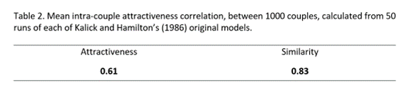

# Replication of Kalick & Hamilton’s (1986) Agent-Based Model of Human Date Choice

## Summary  
This implementation replicates Kalick and Hamilton's (1986) agent-based model of how humans choose romantic partners, as outlined in Grow (2021). This MATLAB function, named runKalickHamilton(), simulates the formation of romantic relationships among a population of a given size, according to the decision rule of either the matching hypothesis (the notion that individuals seek partners of similar attractiveness to themselves) or the attractiveness hypothesis (the notion that individuals seek the most attractive partners that they can find). The function takes the number of agents to-be-coupled and the decision rule (either 'similarity' or 'attractiveness) through which the coupling of the agents is determined.
 
 
. . .
 
## Introduction
Throughout past and present social psychological study, the question of how individuals choose and form romantic relationships has been of substantial intrigue (Mare, 1991; Van Leeuwen et al., 2019). In particular, a breadth of research has sought to explain the established phenomenon of assortative mating – that is, the observation that partners of a romantic couple tend to share more similar characteristics than would be expected by chance (Schwartz, 2013). This empirical interest has given rise to theories such as the matching hypothesis (Walster et al., 1966), which suggests that individuals actively seek partners with comparable social desirability to themselves.
In a key study from Kalick and Hamilton (1986), this theory was tested through the implementation of an agent-based model (ABM), which simulated the formation of romantic couples in a population of virtual individuals (agents), under conditions where the agents’ decision-making processes were manipulated. Specifically, they randomly assigned the agents with scores of physical attractiveness, then examined the coupling process under conditions where agents sought partners of maximally similar scores to themselves, and conditions where agents simply sought partners of maximal attractiveness, irrespective of their own score. By calculating the correlation between the scores of the resulting couple members, and comparing this with the correlations observed in real-life romantic partners, the study offered plausible insight into the mechanisms that underlie the true observed phenomenon of assortative mating in humans.
The details of this model were recently further outlined in a paper from Grow (2021), which sought to replicate Kalick and Hamilton’s original implementation, and examine how changes to the group-level characteristics of the agent population can affect the resulting similarity between the partners of the couples formed. In a similar fashion to Grow’s exploration and testing of the model’s implementations of these two possible social psychological explanations, the present study aimed to replicate Kalick and Hamilton’s original ABM, simulate these similarity-based and attractiveness-based explanations of date choice, and compare the resulting couple correlations of these simulations with those observed in real-life social populations, in order to study the potential value of these ideas as explanations for romantic coupling in humans.
 
 
## Method
As described in Grow’s report, Kalick and Hamilton’s ABM began with the generation of a population comprising two groups, with the members of each group being randomly assigned a physical attractiveness score from a uniform distribution of values ranging 1 to 10. In order to replicate this, we initialised two vectors of uniformly-distributed random values, ranging 1:10, to represent the ‘agents’ and ‘suitors’ that would be paired as prospective couples through the algorithm.

In order to simulate ‘dates’ between the agents and suitors, the original model used another uniform distribution to randomly pair individual members from each group. Once selected for a date, each individual of the selected pair would then probabilistically decide whether or not to couple with their counterpart, on the basis of a given decision rule. For this stage of the model, we similarly used a uniform distribution to randomly select one agent and one suitor for a date, and implemented the same probabilistic equations used in the original algorithm to simulate their respective decisions.
These equations included implementations of the ‘decisions’ of the agent/suitor to couple or not, on the basis of either the attractiveness score of the counterpart with whom they were paired, or the similarity between their own score and that of their counterpart, as well as an equation implementing an iterative correction, applied to each calculated coupling probability, increasing this probability with the number of dates that each individual had already been selected for. This correction was included in order to simulate the ‘settling’ process by which individuals become less particular in their inclination to couple, as the number of unsuccessful dates they go on increases. After 50 dates, this probability jumps to 1, meaning the individual will agree to couple with anybody.

On each date, if the decision probabilities of each pair member determined that they were both willing to couple, they would consequently form a relationship and be removed from the dating pool. If either individual decided not to match, the pairing would be dissolved and a new random pair would be selected for a date. Successful dates were logged by storing the attractiveness values representing each agent and suitor as a row in a ‘couples’ matrix, while replacing their respective indices in the original ‘agents’ and ‘suitors’ vectors with empty spaces. For unsuccessful dates, the agent and suitor values were simply left in their respective vectors and were not added to the couples matrix – allowing for their re-selection for another date. As with the original model, these steps were repeated until all agents and suitors were successfully coupled, and there were no individuals left in the dating pool.

Once the couples vector was filled and the dating pool emptied, the average correlation between the attractiveness scores of the couple members was calculated, in order to allow for the comparison of these coefficients with those observed among real couples, reported in other literature. By comparing the respective correlations produced by the matching hypothesis and attractiveness hypothesis simulations, with these true observed values, the accuracy of each model’s predictions could be evaluated.
 
 
## Results
From running each simulation once, specifying 1000 agents and 1000 suitors in each run, we established an intra-couple attractiveness correlation of 0.6135 from the attractiveness choice rule and an intra-couple attractiveness correlation of 0.6929 from the similarity choice rule. These results are presented in Table 1, below.
 
 
Table 1. Mean intra-couple attractiveness correlation, between 1000 couples’ attractiveness scores, calculated from 50 runs of each simulation within our model.
 
 
  
 
Table 2. Mean intra-couple attractiveness correlation, between 1000 couples’ attractiveness scores, calculated from 50 runs of each simulation within Kalick and Hamilton’s (1986) original model.
 
 
  
 
## Discussion
The existing literature related to the phenomenon of assortative mating in humans reports correlations of .42 (Feingold, 1981) and .53 (Citelli and Waid, 1980) between the traits of romantic partners, as well as correlations of .56 and .63 for serious daters and engaged or married couples (White, 1980; Kaznatcheev et al., 2010). From the comparison between these findings, the coefficients reported by Kalick and Hamilton, and those established by our model, it is apparent that we not only successfully replicated a similar pattern of results to those predicted by the original model, but also that our findings offer additional support for the stronger accuracy of the attractiveness hypothesis in explaining human date choice, given the closer prediction of this simulation to the correlations typically observed between real life romantic partners.

While this short study offers an elementary contribution to the current understanding of human date choice and the phenomenon of assortative mating, this modelling procedure also highlights further opportunities for learning more about this social psychological process. As investigated by Grow (2021), for example, future research could involve the manipulation of parameters, such as the distribution of attractiveness scores in the population, in order to achieve a more comprehensive explanation of the patterns observed between romantic couples, and how these might apply to different groups of individuals. Furthermore, given recent technological advancements in deep learning and artificial intelligence, enabling the acquisition and leveraging of vast datasets for more accurate computational models, simulations and predictions, it will be exciting to see how this discipline and research question evolve over the course of further research.
 
 
## References
Citelli, J., & Waid, L. (1980). Physical attractiveness, romantic love, and equity restoration in dating relationships. Journal of Personality Assessment, 44 , 624- 629.  
 
Feingold, A. (1981) Testing equity as an explanation for romantic couples ‘mismatched’ on physical attractiveness. Psychological Reports, 49 , 247-250.  
 
Grow, A. (2021) The matching hypothesis re-examined once more: does the structure of the partner market matter? In J. van Bavel, D. De Coninck, P. Puschmann, & B. van de Putte (Eds.), Neurotic doubt and sacred curiosity: Essays in honour of Koen Matthijs (pp. 273-286). Centre for Sociological Research, Faculty of Social Sciences, KU Leuven.  
 
Kalick, S. M. & Hamilton, T. E. (1986) The matching hypothesis reexamined. Journal of Personality and Social Psychology, 51(4), 673–682.  
 
Kaznatcheev, A., Brown, K., & Shultz, T. R. (2010) Self-esteem and the matching effect in mate selection. In S. Ohlsson & R. Catrambone (Eds.), Proceedings of the 32nd Annual Conference of the Cognitive Science Society (pp. 972-977). Cognitive Science Society.  
 
Mare, R. D. (1991). Five decades of educational assortative mating. American Sociological Review, 56(1), 15–32.  
 
Schwartz, C. R. (2013) Trends and variation in assortative mating: Causes and consequences. Annual Review of Sociology, 39, 451–470.  
 
Van Leeuwen, M. H. D., Maas, I., Hin, S., & Matthijs, K. (2019). Socio-economic modernization and enduring language barriers: Choosing a marriage partner in Flemish communities. The History of the Family, 24(1), 94–122.  
 
Walster, E., Aronson, V., Abrahams, D. & Rottman, L. (1966) Importance of physical attractiveness in dating behavior. Journal of Personality and Social Psychology, 4, 508-516.  
 
White, G. (1980) Physical attractiveness and courtship progress. Journal of Personality and Social Psychology, 39 , 660-668.  
 
## Acknowledgements
This code used the ideas and equations developed by Kalick and Hamilton (1986), outlined succinctly by Grow (2021), in their valuable contributions to the computational social psychology literature.
 
