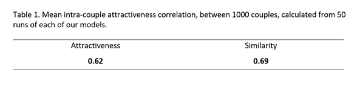

# runKalickHamilton

## Summary  
An implementation of Kalick and Hamilton's (1986) agent-based model of how humans choose romantic partners, as outlined in Grow (2021). This MATLAB function simulates the formation of romantic relationships among a population of a given size, according to the decision rule of either the matching hypothesis (the notion that individuals seek partners of similar attractiveness to themselves) or the attractiveness hypothesis (the notion that individuals seek the most attractive partners that they can find). The function takes the number of agents to-be-coupled and the decision rule (either 'similarity' or 'attractiveness) through which the coupling of the agents is determined.
 
 
. . .
 
## Introduction
A substantial breadth of early social psychological research focused on uncovering the methods with which humans seek and initiate romantic relationships. In particular, much of this literature sought to establish the role of physical attractiveness in this process – giving rise to theories such as the matching hypothesis (Walster et al., 1966), which suggests that individuals seek partners with comparable social desirability to themselves. This hypothesis has been used to explain observations of positive assortative mating, wherein romantic partners are more similar in their characteristics than would otherwise be expected by chance (Schwartz, 2013). A key study from Kalick and Hamilton (1986) examined these ideas, computationally, through the implementation and testing of agent-based models to simulate plausible methods of date choice in humans, and thereby guide this line of theorising with demonstrable evidence. Specifically, the agent-based models developed by Kalick and Hamilton (1986) presented the choosing of romantic partners as a process rooted in logic of the matching hypothesis – with individuals seeking partners of equal physical attractiveness to themselves – and as a process of finding the most attractive partner possible.
These models were thoroughly outlined in a recent paper from Grow (2021), who examined how different manipulations of the parameters within these models can flexibly reflect date choice in populations of various characteristics. In a similar fashion to Grow’s thorough explanation and testing of the equations and procedures comprising these computational social psychology theories, we replicated Kalick and Hamilton’s original models of similarity-based and attractiveness-based date choice - implementing a MATLAB function that simulates coupling at the population level according to these ideas, and calculating the resulting correlation between the attractiveness of the partners within the couples formed, to evaluate the model predictions with the outcomes observed in real life groups.
 
 

## Results
From running each model simulation once, with 1000 agents and 1000 suitors (as specified in Grow’s (2021) report), we established an intra-couple attractiveness correlation of 0.6135 from the attractiveness choice rule model and an intra-couple attractiveness correlation of 0.6929 from the similarity choice rule model. Figures 1 and 2 (below) present these results:
 
 

 
 
From running each model 50 times, and averaging across the correlations determined from each run, the same pattern of results were established:  
 
  
 
This followed a similar pattern of results to the correlations predicted by Kalick and Hamilton's original model:  
 
  
 
## Conclusion
The existing literature related to the phenomenon of assortative mating in humans (that is, the observed similarity that tends to occur between the attractiveness of members of a romantic couple) reports correlations of .42 (Feingold, 1981) and .53 (Citelli and Waid, 1980) between romantic partners, as well as correlations of .56 and .63 for serious daters and engaged or married couples (White, 1980; Kaznatcheev et al., 2010). Given this context, the results that we have established from this replication of Kalick and Hamilton’s ABMs demonstrate not only that our models were able to replicate a similar pattern of results to those established by the original models (presented above), but they also further substantiate the notion that assortative mating in humans can be more accurately explained by the attractiveness hypothesis model – which gives coefficients more reflective of the relationship observed between the attractiveness of romantic partners in real life.
While this short study offers an elementary contribution to the current understanding of human date choice and the phenomenon of assortative mating, consistent the other findings of the field, this modelling procedure also highlights further opportunities for learning more about this social psychological process. As highlighted by Grow (2021), for example, future research could involve the manipulation of parameters such as the distribution of attractiveness scores in the population, in order to achieve a more comprehensive explanation of the patterns observed between romantic couples.
 
 
## References
Citelli, J., & Waid, L. (1980). Physical attractiveness, romantic love, and equity restoration in dating relationships. Journal of Personality Assessment, 44 , 624- 629.  
 
Feingold, A. (1981) Testing equity as an explanation for romantic couples ‘mismatched’ on physical attractiveness. Psychological Reports, 49 , 247-250.  
 
Grow, A. (2021) The matching hypothesis re-examined once more: does the structure of the partner market matter? In J. van Bavel, D. De Coninck, P. Puschmann, & B. van de Putte (Eds.), Neurotic doubt and sacred curiosity: Essays in honour of Koen Matthijs (pp. 273-286). Centre for Sociological Research, Faculty of Social Sciences, KU Leuven.  
 
Kalick, S. M. & Hamilton, T. E. (1986) The matching hypothesis reexamined. Journal of Personality and Social Psychology, 51(4), 673–682.  
 
Kaznatcheev, A., Brown, K., & Shultz, T. R. (2010) Self-esteem and the matching effect in mate selection. In S. Ohlsson & R. Catrambone (Eds.), Proceedings of the 32nd Annual Conference of the Cognitive Science Society (pp. 972-977). Cognitive Science Society.  
 
White, G. (1980) Physical attractiveness and courtship progress. Journal of Personality and Social Psychology, 39 , 660-668.  
 
## Acknowledgements
This code used the ideas and equations developed by Kalick and Hamilton (1986), outlined succinctly by Grow (2021), in their valuable contributions to the computational social psychology literature.
 
